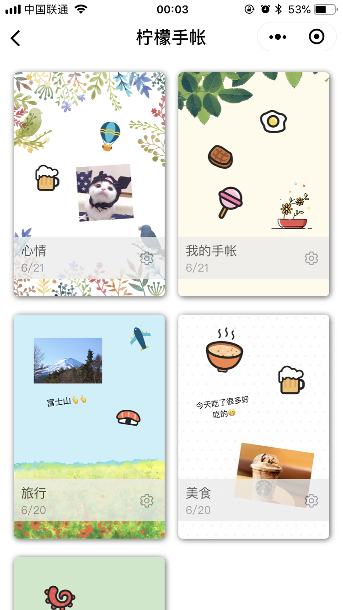
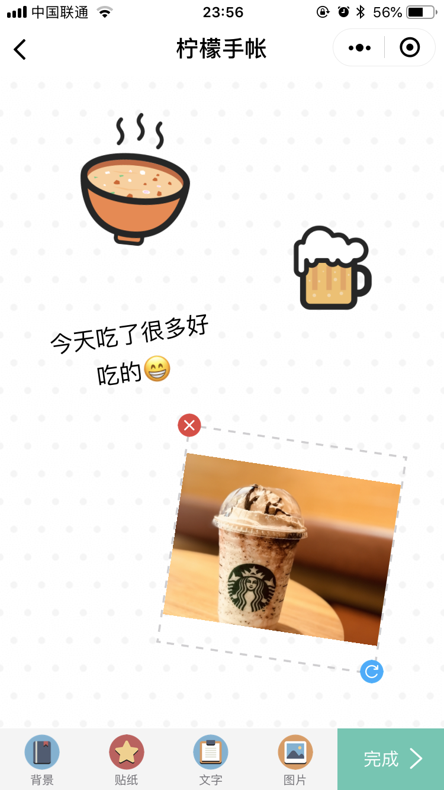
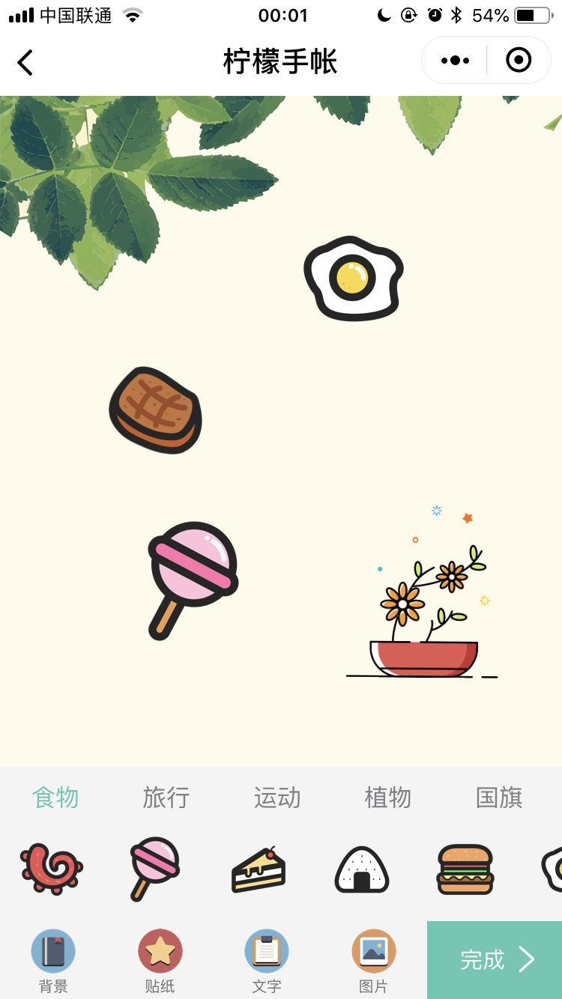
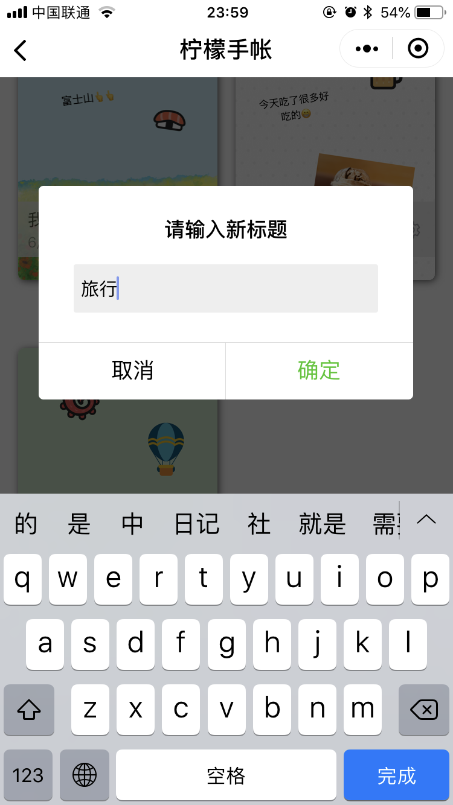

# Weapp-Demo-LemonJournal

[](LICENSE)
[](https://www.javascript.com/)

[](https://github.com/goolhanrry/Weapp-Demo-LemonJournal)

参加比赛的作品，开发周期一个月，使用了 [Wafer2](https://github.com/tencentyun/wafer2-startup) 框架，后台采用腾讯云提供的 Node.js SDK 接入对象存储 API ，前端核心代码实现了类似于图片编辑器的功能，支持图片和文字的移动、旋转、缩放并生成预览图

小程序中的模态输入框部分采用了自己封装的 [InputBox](https://github.com/goolhanrry/Weapp-Demo-Inputbox) 组件

代码已移除 AppId 等敏感信息，可能导致登录报错，但不影响授权后本地使用，可自行添加 AppId 以进行真机调试

## 效果展示

<p align="center">
  
  
  
</p>

<p align="center">
  
  
  
</p>

## 使用方法

* 首先点击右上角 `🌟Star` ʕ •ᴥ•ʔ
* 获取Demo代码
    * 执行 `git clone https://github.com/goolhanrry/Weapp-Demo-LemonJournal.git`
    * 或 [点击此处](https://github.com/goolhanrry/Weapp-Demo-LemonJournal/releases) 下载最新版本的代码
* 解压后在微信开发者工具中打开 `Weapp-Demo-LemonJournal` 文件夹即可

## 核心代码

``` js
onTouchStart: function (e) {
  // 若未选中则直接返回
  if (!this.data.selected) {
    return
  }

  switch (e.target.id) {
    case 'sticker': {
      this.touch_target = e.target.id
      this.start_x = e.touches[0].clientX * 2
      this.start_y = e.touches[0].clientY * 2
      break
    }
    case 'handle': {
      // 隐藏移除按钮
      this.setData({
        hideRemove: true
      })

      this.touch_target = e.target.id
      this.start_x = e.touches[0].clientX * 2
      this.start_y = e.touches[0].clientY * 2

      this.sticker_center_x = this.data.stickerCenterX;
      this.sticker_center_y = this.data.stickerCenterY;
      this.remove_center_x = this.data.removeCenterX;
      this.remove_center_y = this.data.removeCenterY;
      this.handle_center_x = this.data.handleCenterX;
      this.handle_center_y = this.data.handleCenterY;

      this.scale = this.data.scale;
      this.rotate = this.data.rotate;
      break
    }
  }
},

onTouchEnd: function (e) {
  this.active()
  this.touch_target = ''

  // 显示移除按钮
  this.setData({
    removeCenterX: 2 * this.data.stickerCenterX - this.data.handleCenterX,
    removeCenterY: 2 * this.data.stickerCenterY - this.data.handleCenterY,
    hideRemove: false
  })

  // 若点击移除按钮则触发移除事件，否则触发刷新数据事件
  if (e.target.id === 'remove') {
    this.triggerEvent('removeSticker', this.data.sticker_id)
  } else {
    this.triggerEvent('refreshData', this.data)
  }
},

onTouchMove: function (e) {
  // 若无选中目标则返回
  if (!this.touch_target) {
    return
  }

  var current_x = e.touches[0].clientX * 2
  var current_y = e.touches[0].clientY * 2
  var diff_x = current_x - this.start_x
  var diff_y = current_y - this.start_y

  switch (e.target.id) {
    case 'sticker': {
      // 拖动组件则所有控件同时移动
      this.setData({
        stickerCenterX: this.data.stickerCenterX + diff_x,
        stickerCenterY: this.data.stickerCenterY + diff_y,
        removeCenterX: this.data.removeCenterX + diff_x,
        removeCenterY: this.data.removeCenterY + diff_y,
        handleCenterX: this.data.handleCenterX + diff_x,
        handleCenterY: this.data.handleCenterY + diff_y
      })
      break
    }
    case 'handle': {
      // 拖动操作按钮则原地旋转缩放
      this.setData({
        handleCenterX: this.data.handleCenterX + diff_x,
        handleCenterY: this.data.handleCenterY + diff_y
      })

      var diff_x_before = this.handle_center_x - this.sticker_center_x;
      var diff_y_before = this.handle_center_y - this.sticker_center_y;
      var diff_x_after = this.data.handleCenterX - this.sticker_center_x;
      var diff_y_after = this.data.handleCenterY - this.sticker_center_y;
      var distance_before = Math.sqrt(diff_x_before * diff_x_before + diff_y_before * diff_y_before);
      var distance_after = Math.sqrt(diff_x_after * diff_x_after + diff_y_after * diff_y_after);
      var angle_before = Math.atan2(diff_y_before, diff_x_before) / Math.PI * 180;
      var angle_after = Math.atan2(diff_y_after, diff_x_after) / Math.PI * 180;

      this.setData({
        scale: distance_after / distance_before * this.scale,
        rotate: angle_after - angle_before + this.rotate
      })
      break
    }
  }

  this.start_x = current_x;
  this.start_y = current_y;
}
```

## 捐赠

作者是一名大二学生，如果觉得我写得不错，不如请我喝杯咖啡吧 ☕️

<p align="center">
  
  
</p>

## License

[MIT License](LICENSE)

Copyright (c) 2018 goolhanrry
