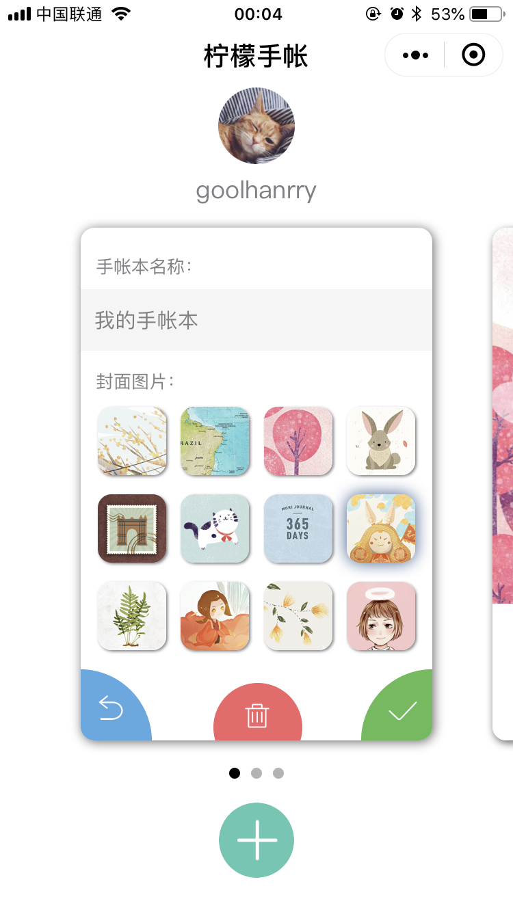
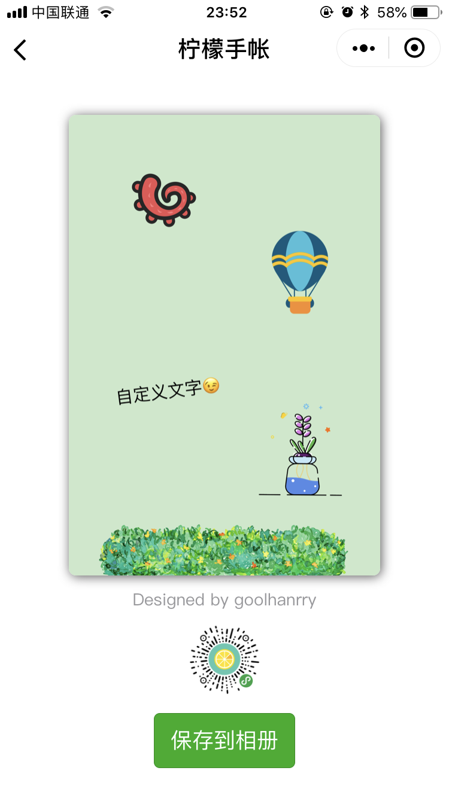

# LemonJournal

[](LICENSE)
[](https://www.javascript.com/)

该项目基于 [Wafer2](https://github.com/tencentyun/wafer2-startup) 框架开发，后台采用腾讯云提供的 Node.js SDK 接入对象存储 API ，前端核心代码实现了图片编辑器的功能，支持图片和文字的移动、旋转、缩放、生成预览图以及编辑状态的保存，动画部分采用 CSS 动画实现

小程序中的模态输入框为单独封装的 [InputBox](https://github.com/yeliudev/weapp-inputbox) 组件

代码已移除 AppId 等敏感信息，可自行添加自己的 AppId 和 AppSecret 以配置后台环境，实现登录测试，详细添加方法见下文「使用方法」，若本地运行可通过修改 `app.json` 文件中 `page` 字段的顺序来查看不同页面

## 效果展示

<p align="center">
  
  
  
</p>

<p align="center">
  
  
  
</p>

## 使用方法

* 获取Demo代码
    * 执行 `git clone https://github.com/yeliudev/LemonJournal.git`
* 下载后在微信开发者工具中打开 `LemonJournal` 文件夹即可

#### 如需进行登录测试，还要执行以下步骤

* 准备好自己的 AppId 和 AppSecret（可在微信公众平台注册后获取）
* 在 `project.config.json` 的 `appid` 字段中填入 AppId
* 在 `/client/utils/util.js` 中相应位置填入 AppId 和 AppSecret
* 在微信开发者工具中重新导入整个项目，上传后台代码后编译运行即可

## 核心代码

#### 组件的移动、旋转和缩放

* 主要思路为将 `<image>` 标签（对应图片）和 `<text>` 标签（对应文字）封装在同一个自定义组件 `<sticker>` 中，通过对外暴露的 `text` 变量是否为空来进行条件渲染，然后绑定 `onTouchStart()` 、`onTouchEnd()` 和 `onTouchMove()` 三个事件来对整个组件的位置、角度、大小、层级以及 “旋转” 和 “移除” 两个按钮的行为进行操作

``` js
onTouchStart: function (e) {
    // 若未选中则直接返回
    if (!this.data.selected) {
        return
    }

    switch (e.target.id) {
        case 'sticker': {
            this.touch_target = e.target.id
            this.start_x = e.touches[0].clientX * 2
            this.start_y = e.touches[0].clientY * 2
            break
        }
        case 'handle': {
            // 隐藏移除按钮
            this.setData({
                hideRemove: true
            })

            this.touch_target = e.target.id
            this.start_x = e.touches[0].clientX * 2
            this.start_y = e.touches[0].clientY * 2

            this.sticker_center_x = this.data.stickerCenterX;
            this.sticker_center_y = this.data.stickerCenterY;
            this.remove_center_x = this.data.removeCenterX;
            this.remove_center_y = this.data.removeCenterY;
            this.handle_center_x = this.data.handleCenterX;
            this.handle_center_y = this.data.handleCenterY;

            this.scale = this.data.scale;
            this.rotate = this.data.rotate;
            break
        }
    }
},

onTouchEnd: function (e) {
    this.active()
    this.touch_target = ''

    // 显示移除按钮
    this.setData({
        removeCenterX: 2 * this.data.stickerCenterX - this.data.handleCenterX,
        removeCenterY: 2 * this.data.stickerCenterY - this.data.handleCenterY,
        hideRemove: false
    })

    // 若点击移除按钮则触发移除事件，否则触发刷新数据事件
    if (e.target.id === 'remove') {
        this.triggerEvent('removeSticker', this.data.sticker_id)
    } else {
        this.triggerEvent('refreshData', this.data)
    }
},

onTouchMove: function (e) {
    // 若无选中目标则返回
    if (!this.touch_target) {
        return
    }

    var current_x = e.touches[0].clientX * 2
    var current_y = e.touches[0].clientY * 2
    var diff_x = current_x - this.start_x
    var diff_y = current_y - this.start_y

    switch (e.target.id) {
        case 'sticker': {
            // 拖动组件则所有控件同时移动
            this.setData({
                stickerCenterX: this.data.stickerCenterX + diff_x,
                stickerCenterY: this.data.stickerCenterY + diff_y,
                removeCenterX: this.data.removeCenterX + diff_x,
                removeCenterY: this.data.removeCenterY + diff_y,
                handleCenterX: this.data.handleCenterX + diff_x,
                handleCenterY: this.data.handleCenterY + diff_y
            })
            break
        }
        case 'handle': {
            // 拖动操作按钮则原地旋转缩放
            this.setData({
                handleCenterX: this.data.handleCenterX + diff_x,
                handleCenterY: this.data.handleCenterY + diff_y
            })

            var diff_x_before = this.handle_center_x - this.sticker_center_x;
            var diff_y_before = this.handle_center_y - this.sticker_center_y;
            var diff_x_after = this.data.handleCenterX - this.sticker_center_x;
            var diff_y_after = this.data.handleCenterY - this.sticker_center_y;
            var distance_before = Math.sqrt(diff_x_before * diff_x_before + diff_y_before * diff_y_before);
            var distance_after = Math.sqrt(diff_x_after * diff_x_after + diff_y_after * diff_y_after);
            var angle_before = Math.atan2(diff_y_before, diff_x_before) / Math.PI * 180;
            var angle_after = Math.atan2(diff_y_after, diff_x_after) / Math.PI * 180;

            this.setData({
                scale: distance_after / distance_before * this.scale,
                rotate: angle_after - angle_before + this.rotate
            })
            break
        }
    }

    this.start_x = current_x;
    this.start_y = current_y;
}
```

#### 编辑状态的保存

* 一篇手帐包含的组件类型包括 `sticker`（软件自带的贴纸）、`image`（用户上传的图片）和 `text`（自定义文字）三种，全部保存在一个如下格式的 json 对象中，每个独立组件都包含了一个不重复的 id 以及相关的信息，保存时由客户端生成该对象并编码成 json 字符串存储在数据库，恢复编辑状态时通过解析 json 字符串获得对象，再由编辑页面渲染

``` js
{
    "backgroundId": "5",                                        背景图id
    "assemblies": [
        {
            "id": "jhjg",                                       组件id
            "component_type": "image",                          组件类型（自定义图片）
            "image_url": "https://example.com/jhjg.png",        图片地址
            "stickerCenterX": 269,                              中心横坐标
            "stickerCenterY": 664,                              中心纵坐标
            "scale": 1.7123667831396403,                        缩放比例
            "rotate": -3.0127875041833434,                      旋转角度
            "wh_scale": 1,                                      图片宽高比
            "z_index": 19                                       组件层级
        },
        {
            "id": "gs47",
            "component_type": "text",                           组件类型（文字）
            "text": "test",                                     文字内容
            "stickerCenterX": 479,
            "stickerCenterY": 546,
            "scale": 1.808535318980528,
            "rotate": 29.11614626607893,
            "z_index": 10
        },
        {
            "id": "chjn",
            "component_type": "sticker",                        组件类型（贴纸）
            "sticker_type": "food",                             贴纸类型
            "sticker_id": "1",                                  贴纸id
            "image_url": "https://example.com/weapp/stickers/food/1.png",
            "stickerCenterX": 277,
            "stickerCenterY": 260,
            "scale": 1.3984276885130673,
            "rotate": -16.620756913892055,
            "z_index": 5
        }
    ]
}
```

## License

[MIT License](LICENSE)

Copyright (c) 2021 Ye Liu
